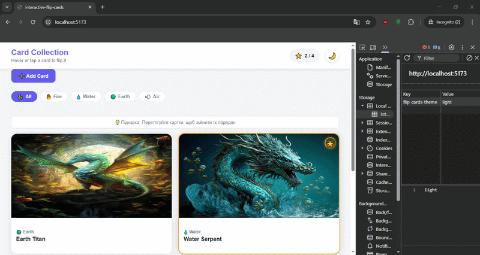

# 🐉 Interactive Flip Cards

React + TypeScript додаток з інтерактивними картками драконів.

## Features

- 3D CSS Flip анімація при hover
- Drag & Drop для зміни порядку (нативний HTML5)
- Light / Dark тема з збереженням в localStorage
- Фільтрація за категорією (fire / water / earth / air)
- CRUD — додавання та видалення карток
- Favorites з лічильником
- Звуковий ефект при перевертанні
- Збереження стану в localStorage

## Tech Stack

React 19 · TypeScript · Vite · CSS 3D Transforms · HTML5 DnD API

## Run locally

git clone https://github.com/MykytaMusaiev/interactive-flip-cards.git
npm install
npm run dev
